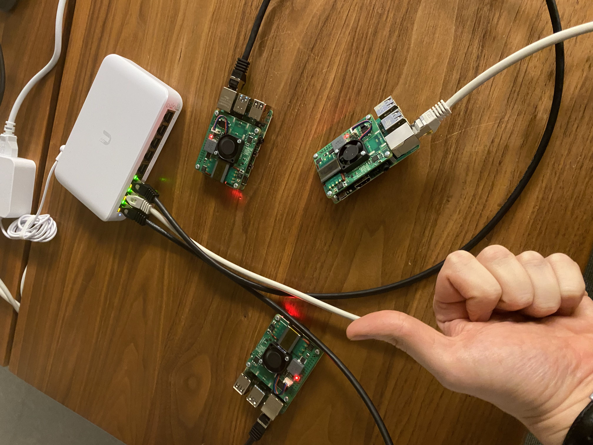

# PiClusterChef

Cook up and scale a k3s kubernetes cluster on Raspberry pies with a single command.

Tutorial blog post can be found [here](https://dev.to/hatati/cook-up-a-k3s-cluster-on-raspberry-pies-with-ansible-4bb4).



## Inventory file

Add your Raspberry pi hosts in the *inventory.yaml*.

> **Note**: If you change the name of the `nerminmaster` host, remember to change `nerminmaster` in the *install-k3s-playbook.yaml* file too.

## Create the k3s cluster

Create the k3s cluster by executing the install playbook:

```bash
$ ansible-playbook -i inventory.yaml install-k3s-playbook.yaml
```

That's it!

The playbook downloaded the kubeconfig file from the bootstrap master to the current directory on the local machine with the name *k3sconfig*. The file looks like this:

```yaml
apiVersion: v1
clusters:
- cluster:
    certificate-authority-data: ...
    server: https://127.0.0.1:6443
  name: default
contexts:
- context:
    cluster: default
    user: default
  name: default
current-context: default
kind: Config
preferences: {}
users:
- name: default
  user:
    client-certificate-data: ...
    client-key-data: ...
```

Replace the localhost IP in the `server` value with the IP or hostname of the bootstrap master node.

```yaml
apiVersion: v1
clusters:
- cluster:
    certificate-authority-data: ...
    server: https://nerminmaster:6443  # <----- This value here.
  name: default
contexts:
- context:
    cluster: default
    user: default
  name: default
current-context: default
kind: Config
preferences: {}
users:
- name: default
  user:
    client-certificate-data: ...
    client-key-data: ...
```

Verify that the cluster is up and running:

```bash
$ kubectl get nodes --kubeconfig k3sconfig
NAME            STATUS   ROLES                       AGE     VERSION
nerminmaster    Ready    control-plane,etcd,master   8m42s   v1.24.10+k3s1
nerminworker1   Ready    <none>                      8m7s    v1.24.10+k3s1
```

Success.

## Clean up

Run the *uninstall-k3s-playbook* to remove k3s from all the nodes:

```bash
$ ansible-playbook -i inventory.yaml uninstall-k3s-playbook.yaml
```
